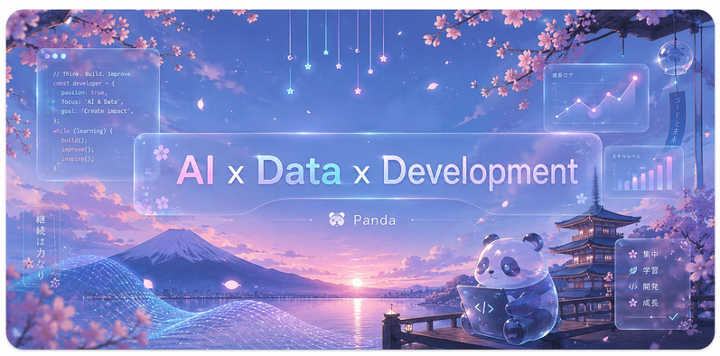

<p align="center">
  
</p>

<h1 align="center">Hi, I'm Panda! 👋</h1>

<p align="center">
  <strong>AI</strong> · <strong>Data</strong> · <strong>Development</strong> · <strong>Product</strong>
</p>

<p align="center">
  <strong>English</strong>
  ·
  <a href="./README.zh-CN.md">中文</a>
</p>

<br />

<p align="center">
  <a href="#languages-and-tools">Languages & Tools</a>
  ·
  <a href="#what-im-building">What I'm Building</a>
  ·
  <a href="#learning-map">Learning Map</a>
  ·
  <a href="#about-me">About Me</a>
  ·
  <a href="#connect">Connect</a>
</p>

<br />

<table width="100%">
  <tr>
    <td width="25%"></td>
    <td width="50%" align="center">
      <h2 id="languages-and-tools">Languages and Tools</h2>
    </td>
    <td width="25%" align="right">
      
    </td>
  </tr>
</table>

<p align="center">
  
</p>

<br />

## What I'm Building

<table>
  <tr>
    <td width="50%">
      <h3>Japanese Learning Web App</h3>
      <p>A focused study experience for vocabulary, grammar, review flows, and learning progress.</p>
      <p><code>React</code> <code>TypeScript</code> <code>Study UX</code> <code>AI Assist</code></p>
    </td>
    <td width="50%">
      <h3>JLPT Grammar Card Website</h3>
      <p>Clean grammar cards designed for quick scanning, example review, search, and long-term retention.</p>
      <p><code>JLPT</code> <code>Markdown</code> <code>Frontend</code> <code>Content System</code></p>
    </td>
  </tr>
  <tr>
    <td width="50%">
      <h3>AI Productivity Tools</h3>
      <p>Small utilities for writing, summarizing, organizing notes, and turning ideas into usable workflows.</p>
      <p><code>AI</code> <code>Automation</code> <code>Productivity</code></p>
    </td>
    <td width="50%">
      <h3>Personal Blog</h3>
      <p>A place to document frontend notes, Japanese learning methods, AI experiments, and product thinking.</p>
      <p><code>Blog</code> <code>Knowledge Base</code> <code>Learning Notes</code></p>
    </td>
  </tr>
</table>

<br />

## Learning Map

<div align="center">

| Area | Currently Exploring | Goal |
|---|---|---|
| Frontend | React, TypeScript, Next.js, Tailwind CSS | Build polished and reliable web apps |
| Japanese | JLPT grammar, vocabulary systems, reading habits | Make learning more structured and repeatable |
| AI | Prompt design, AI-assisted writing, workflow tools | Turn AI into practical product features |
| Product | UX details, content structure, lightweight systems | Ship tools that feel simple and useful |

</div>

<br />

## Product Notes

```txt
I care about products that are:

- Clear enough to use without explanation
- Small enough to ship and improve
- Useful enough to become part of a daily routine
- Calm in design, but sharp in execution
```

<br />

## About Me

I am a growing learner and builder interested in the intersection of AI, data, and product design.  
This profile is a small window into what I am learning, what I am building, and how my projects are taking shape.

I enjoy solving messy data problems and turning ideas into small tools that are actually usable.  
My current direction is simple: build useful tools, document the process, and improve one project at a time.

Outside of work and study, I enjoy models, good food, and planning the next small adventure.

<br />

## Connect

<p align="center">
  <a href="https://github.com/panda-pig">
    
  </a>
  <a href="https://blog-beta-kohl-92.vercel.app">
    
  </a>
</p>

<br />

<p align="center">
  <sub>No private phone number, address, or personal email is shared here.</sub>
</p>

<p align="center">
  <strong>Learning deeply. Building quietly. Shipping thoughtfully.</strong>
</p>
